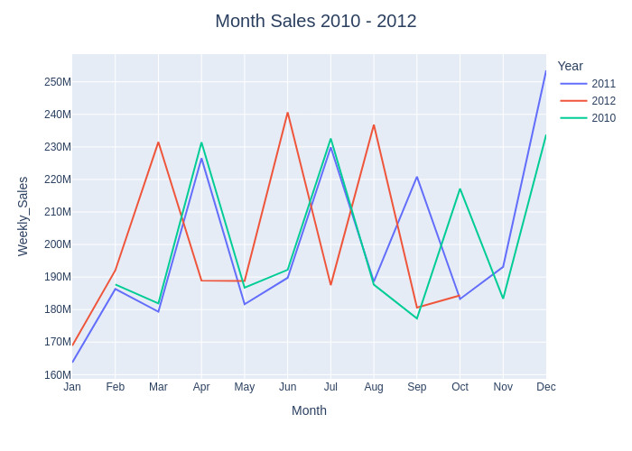
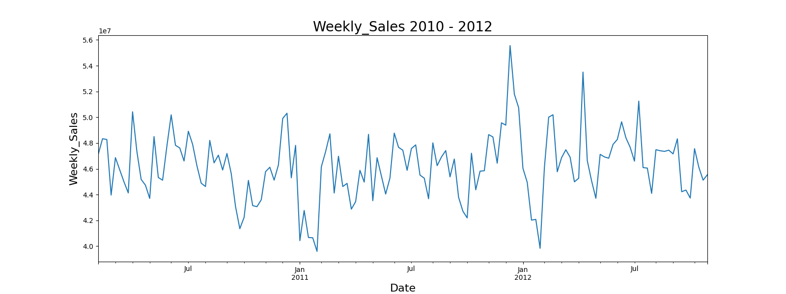
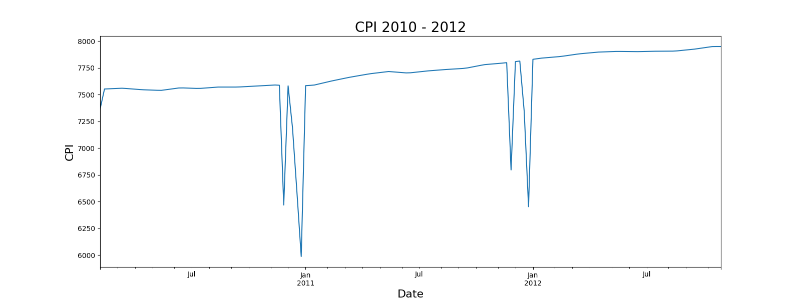

# Predictive Modeling for Walmart Sales Using Time Series Forecasting
source dataset : https://www.kaggle.com/datasets/mikhail1681/walmart-sales

## Overview
Walmart is one of the biggest retailers in the world, known for its low-cost, high volume and multi channel approach. Walmart's target market include middle to low income individuals, as well as people who live in rural areas.

Walmart sales data is usually used for predicting and forecasting sales, optimizing sales, and analyzing customer behavior. To achieve this, we can conduct a comprehensive analysis of previous sales data.

## Data Description

| Column         | Description                      |
|----------------|----------------------------------|
| Store          | Store identifier               |
| Date           | Date of the transaction                 |
| Weekly Sales   | Weekly sales               |
| Holiday Flag   | National holiday (1 for yes, 0 for no) |
| Temperature    | Temperature in Fahrenheit |
| Fuel_Price     | Fuel price per gallon       |
| CPI            | Consumer Price Index |
| Unemployment   | Unemployment rate             |

- Rows: 6435
- Columns: 8
- Null values: 0

### Time
The data from:

- 2010: 5 February - 31 December, 330 days
- 2011: 1 January -  31 December, 365 days
- 2012: 1 january - 26 October, 294 days

## Exploratory Data Analysis

### Year

### Month

### Weekly

As you can see, the data shows the sales history from February 2010 to October 2012. The sales performance indicates that 2011 had the highest sales over the three-year period. However 2011 covers a full year of 365 days, unlike 2010 and 2012. If we consider sales potential, 2012 seems more promising due to certain factors.

#### Factor

During national holidays, the data shows that people tend to avoid going to Walmart because it is a day of rest. This situation can be improved by offering customers additional benefits such as discounts, buy 1 get 1 offers, coupons, vouchers, cashback, bundle deals, flash sales, free shipping, events, and special promotions.

Temperature plays a significant role in people's behavior; they tend to avoid going out if the weather is uncomfortable. For this reason, stores should provide air conditioning to keep the area cool. In the sales chart, we can see that early winter shows higher sales because the temperature is more comfortable, and afterward, people begin preparing for the rest of the winter.

CPI, or Consumer Price Index, shows the inflation rate of products. Although CPI tends to rise over time, this is not necessarily a bad thing, as consumer purchasing power can also increase. As shown in the chart below, unemployment has decreased over time.

## Analysis Approach

Walmart data sales provide by walmart in kaggle websites, for preprocessing data for handle missing value and features engineering I am using pandas. For feature engineering use the lags features in seven days sales, and time based features.

For my machine learning tasks, I am using XGBoost because of its reliability in forecasting, ability to handle complex data, and strong performance with time series data. 

For evaluation metrics, Root Mean Squared Error(RMSE) is suitable for forecasting models beside that, RMSE is easy to interpreted, the lower value, the better the models. RMSE also give insight how the data perform, because RMSE sensitive about outliears.

### Feature Engineering

| **Features**  | **Description**                                                                                     |
|------------------|-----------------------------------------------------------------------------------------------------|
| `Hour`           | Indicates the hour (0-23) of a specific time or date.                                                |
| `DayOfWeek`      | Indicates the day of the week (0-6), where 0 is Monday and 6 is Sunday.                              |
| `Week`           | Indicates the week number of the year (1-52 or 1-53, depending on the calendar).                     |
| `Month`          | Indicates the month of the year (1-12).                                                              |
| `Quarter`        | Indicates the quarter of the year (1-4), where 1 is January-March, and so on.                        |
| `Year`           | Indicates the year of the data.                                                                      |
| `DayOfYear`      | Indicates the day of the year (1-365 or 1-366 for leap years).                                        |
| `Lags1`          | The first lag value, representing the data value from the previous period.                           |
| `Lags2`          | The second lag value, representing the data value from two periods ago.                              |
| `Lags3`          | The third lag value, representing the data value from three periods ago.                             |
| `Diff`           | The difference between the current value and the previous value (difference).                        |
| `RollingMean`    | The rolling mean or moving average, often used to smooth data or identify trends.                    |
| `SinWeek`        | Sinusoidal representation of the week, used in seasonal analysis based on weekly periodicity.        |
| `CosWeek`        | Cosine representation of the week, used in seasonal analysis based on weekly periodicity.            |

### Result

The Y-axis represents the return value, which is the percentage change calculated from weekly sales. The return value shows how much sales have increased or decreased on a percentage scale. The chart displays the growth and decline in sales projected for the next six months.

## Conclusion

The sales performance from walmart store is predicted kinda good in next six month. To ensure this predicted correct, the store need to keep customers loyalty with such as event, coupons, vouchers, cashback, bundle deals, special promotions, etc. For make sure customer happy by purchase in the store
