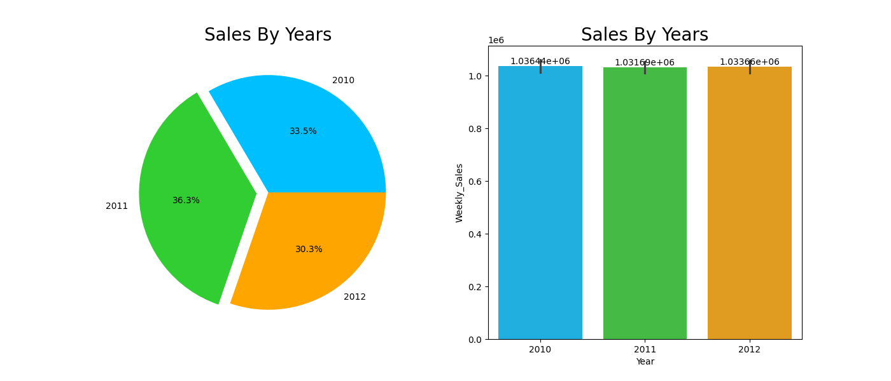
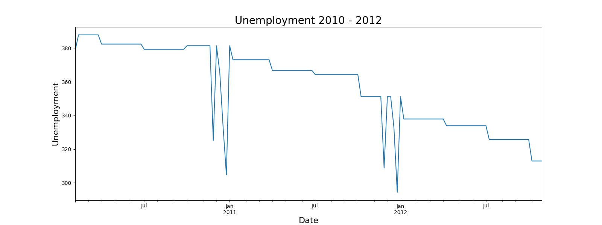

# Predictive Modeling for Walmart Sales Using Time Series Forecasting
source dataset : https://www.kaggle.com/datasets/mikhail1681/walmart-sales

## Overview
Walmart is one of the biggest retailers in the world, known for its low-cost, high volume and multi channel approach. Walmart's target market include middle to low income individuals, as well as people who live in rural areas.

Walmart sales data is usually used for predicting and forecasting sales, optimizing sales, and analyzing customer behavior. To achieve this, we can conduct a comprehensive analysis of previous sales data.

## Data Description

| Column         | Description                      |
|----------------|----------------------------------|
| Store          | Store identifier               |
| Date           | Date of the transaction                 |
| Weekly Sales   | Weekly sales               |
| Holiday Flag   | National holiday (1 for yes, 0 for no) |
| Temperature    | Temperature in Fahrenheit |
| Fuel_Price     | Fuel price per gallon       |
| CPI            | Consumer Price Index |
| Unemployment   | Unemployment rate             |

- Rows: 6435
- Columns: 8
- Null values: 0

### Time
The data from:

- 2010: 5 February - 31 December, 330 days
- 2011: 1 January -  31 December, 365 days
- 2012: 1 january - 26 October, 294 days

## Exploratory Data Analysis

### Year

### Month

### Weekly

As you can see, the data shows the sales history from February 2010 to October 2012. The sales performance indicates that 2011 had the highest sales over the three-year period. However 2011 covers a full year of 365 days, unlike 2010 and 2012. If we consider sales potential, 2012 seems more promising due to certain factors.

#### Factor

During national holidays, the data shows that people tend to avoid going to Walmart because it is a day of rest. This situation can be improved by offering customers additional benefits such as discounts, buy 1 get 1 offers, coupons, vouchers, cashback, bundle deals, flash sales, free shipping, events, and special promotions.

Temperature plays a significant role in people's behavior; they tend to avoid going out if the weather is uncomfortable. For this reason, stores should provide air conditioning to keep the area cool. In the sales chart, we can see that early winter shows higher sales because the temperature is more comfortable, and afterward, people begin preparing for the rest of the winter.

CPI, or Consumer Price Index, shows the inflation rate of products. Although CPI tends to rise over time, this is not necessarily a bad thing, as consumer purchasing power can also increase. As shown in the chart below, unemployment has decreased over time.

## Analysis Approach

Walmart data sales provide by walmart in kaggle websites, for preprocessing data for handle missing value and features engineering I am using pandas. For feature engineering use the lags features in seven days sales, and time based features.

For machine learning, I am using XGBoost because reliability in forecasting, handling complex data, strong performance in time series data. I make three models XGBoost with different features to compare reliability and performance, the first model I am using TimeSeriesSplit from sklearn for split data by date, second model not using TimeSeriesSplit and using all the data, the third model not using lags features and TimeSeriesSplit to see how much the impact from features lags and split data by date.
